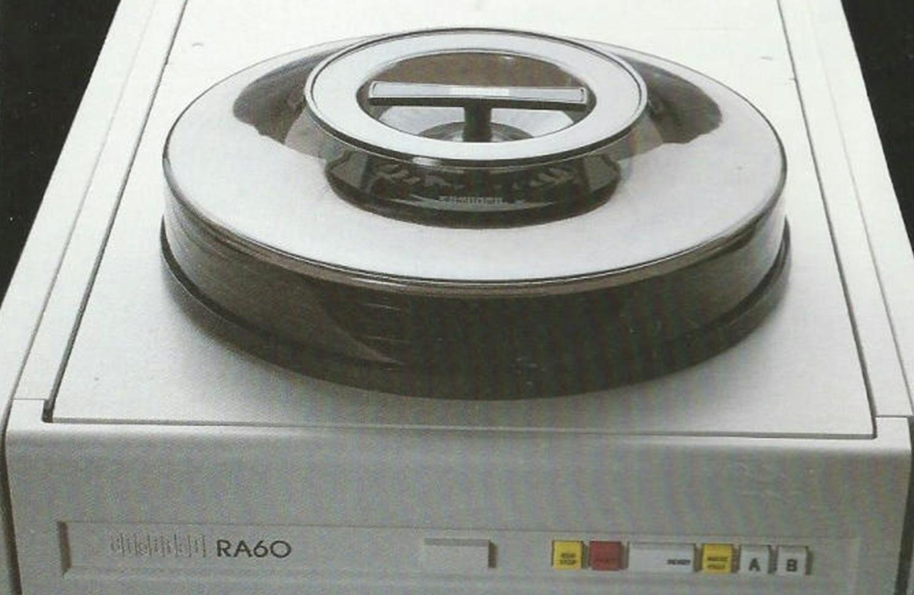

# RA60

Το RA60 είναι ένας οδηγός δίσκων μετακινήσιμου μέσου, o μόνος τέτοιος οδηγός στην οικογένεια RAxx, καθώς όλα τα άλλα μέλη της οικογένειας είναι μη-μετακινήσιμου μέσου. Παρουσιάστηκε το 1982 από την Digital Equipment Corporation (DEC) ως μέρος της Ψηφιακής Αρχιτεκτονικής Αποθήκευσής (Digital Storage Architecture) της. Συνδεόταν σε ελεγκτή μέσω ενός διαύλου Standard Disk Interconnect (SDI), όπως και τα RA80 και RA81 της συλλογής μας. Παρέχει 205MB ωφέλιμου χώρου αποθήκευσης ή 615ΜΒ (3 x 205) σε διάταξη μιας καμπίνας ύψους 42 ιντσών (περίπου 1 μέτρο). The RA60 μπορούσε να συνδεθεί σε διαμόρφωση δύο εισόδων (dual port) ώστε να επιτρέπει χρονομερισμένη πρόσβαση από δύο ελεγκτές.

