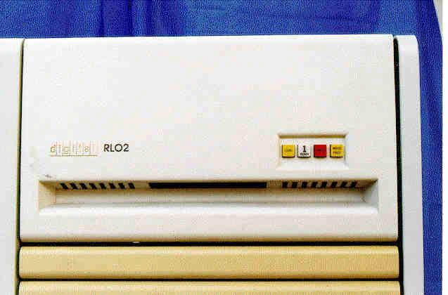

# RL02

Το RL02 είναι ένας οδηγός δίσκου μετακινήσιμου πακέτου (pack) μιας επιφάνειας, που παρουσιάστηκε το 1978 από την Digital Equipment Corporation (DEC). Χρησιμοποιούσε πακέτα τύπου IBM 5440, όπως και το IBM System/3. Μέχρι 4 δίσκοι μπορούσαν να συνδεθούν σε έναν ελεγκτή σε σειριακή διάταξη. Το συνολικό μήκος της διάταξης δεν μπορούσε να υπερβαίνει τα 100 πόδια (περίπου 30 μέτρα). Το RL02 είναι δίσκος των 10MB, μια έκδοση υψηλότερης πυκνότητας του προηγούμενου RL01 (δίσκος 5MB), με διπλάσιες διαδρομές (tracks) ανά επιφάνεια.

