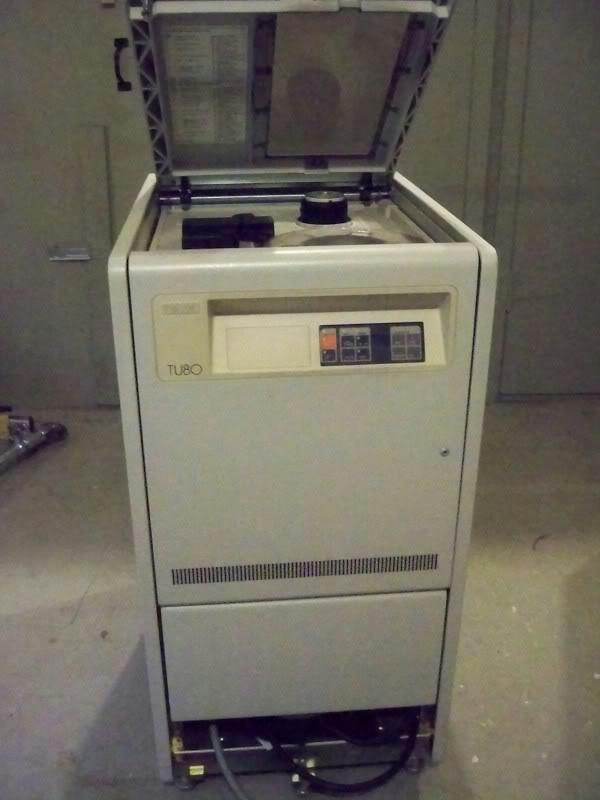

# TU80

To TU80 είναι ένα χειροκίνητα φορτώσιμο υποσύστημα μαγνητικής ταινίας μισής ίντσας (1.27 εκατοστών), με 9 τροχιές (tracks), προτύπου ANSI, με κωδικοποίηση φάσης (Phase Encoding ή PE) για πυκνότητα 1600 bits/inch (bpi), το οποίο κατασκευάστηκε από την Digital Equipment Corporation (DEC). To TU80 παρουσιάστηκε το 1983 και προοριζόταν για χρήση στα συστήματα PDP-11 και VAX με κύριο σκοπό την λήψη εφεδρικών αντιγράφων δεδομένων (data backups). Χρησιμοποιούσε την διεπαφή ταινίας Pertec. Ελεγχόταν από επεξεργαστή Motorola 6802, μια παραλλαγή του 6800 με 128 bytes εσωτερικής RAM και εσωτερικό ταλαντωτή ρολογιού.  Υπήρχαν επίσης πέντε προσαρμογείς παράλληλης διεπαφής 6821 για διασύνδεση με τα διάφορα μέρη των διαύλων συστήματος. Το λογισμικό (firmware) του αποθηκεύεται σε μια ROM των 8KB.

