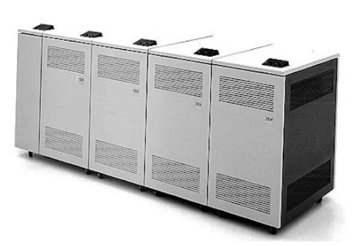

# IBM 3370 Direct Access Storage Devices

Η IBM εισήγαγε τη σειρά IBM 3370 συσκευών αποθήκευσης άμεσης προσπέλασης τον Ιανουάριο του 1979 για τους υπολογιστές IBM 4331, 4341 και System/38 μέσης κλίμακας (midrange).

Κάθε μονάδα διαθέτει επτά (7) σταθερούς δίσκους των 14 ιντσών (360 mm), προσφέροντας συνολική χωρητικότητα 571 MB. Ήταν ο πρώτος σκληρός δίσκος που χρησιμοποίησε τεχνολογία λεπτού φιλμ (thin-film) για τις κεφαλές ανάγνωσης/εγγραφής.

Η έρευνα πάνω σε αυτή την τεχνολογία ξεκίνησε στο ερευνητικό κέντρο Thomas J. Watson της IBM στα τέλη της δεκαετίας του 1960.

Το 3370 ήταν μια συσκευή σταθερού μεγέθους σελίδας (block), που χρησιμοποιήθηκε σε λειτουργικά συστήματα και περιβάλλοντα του S/370 DOS/VSE και VM — τα μόνα λειτουργικά συστήματα που υποστήριζαν συσκευές σταθερού μεγέθους σελίδας (fixed block size, FBA).

