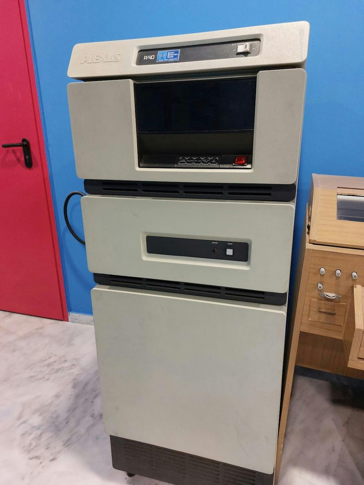

# Plexus P/40

Το Plexus P/40 παρουσιάστηκε στις αρχές της δεκαετίας του 1980 ως ένας υπολογιστής που προσέφερε το λειτουργικό σύστημα UNIX. Βασίστηκε στον επεξεργαστή Zilog Z8000 των 16-bit με 512KB μνήμης με αυτόματη διόρθωση λαθών, επεκτάσιμη σε 4MB.

Υποστήριζε μέχρι και 40 ταυτόχρονους διαδραστικούς χρήστες. Μια τυπική διαρρύθμιση του P/40 περιελάμβανε έναν επεξεργαστή εργασίας και 2 επεξεργαστές εισόδου/εξόδου (I/O).

Κατά τη λειτουργία, ο επεξεργαστής εργασίας εκτελούσε υπολογισμούς και λειτουργίες του λειτουργικού συστήματος ενώ οι επεξεργαστές I/O διαχειρίζονταν τον δίσκο, την ταινία, και τη σειριακή είσοδο/έξοδο.

Το P/40 έτρεχε την έκδοση του UNIX III της AT&T, γραμμένο σε C, και υποστήριζε τις γλώσσες BASIC, COBOL, FORTRAN, και Pascal.

Ο P/40 περιλάμβανε έναν έξυπνο επεξεργαστή μαζικής αποθήκευσης (IMSP) των 16-bit με 128KB τοπικής μνήμης, ικανό να ελέγχει μέχρι 4 δίσκους Winchester 14 ιντσών 72MB ή 145MB και μία ταινία 1/2-ίντσας, 9-διαδρομών, 1,600-bpi.

Οι P/40 μπορούσαν να διασυνδεθούν σε ένα τοπικό δίκτυο Xerox Ethernet.

