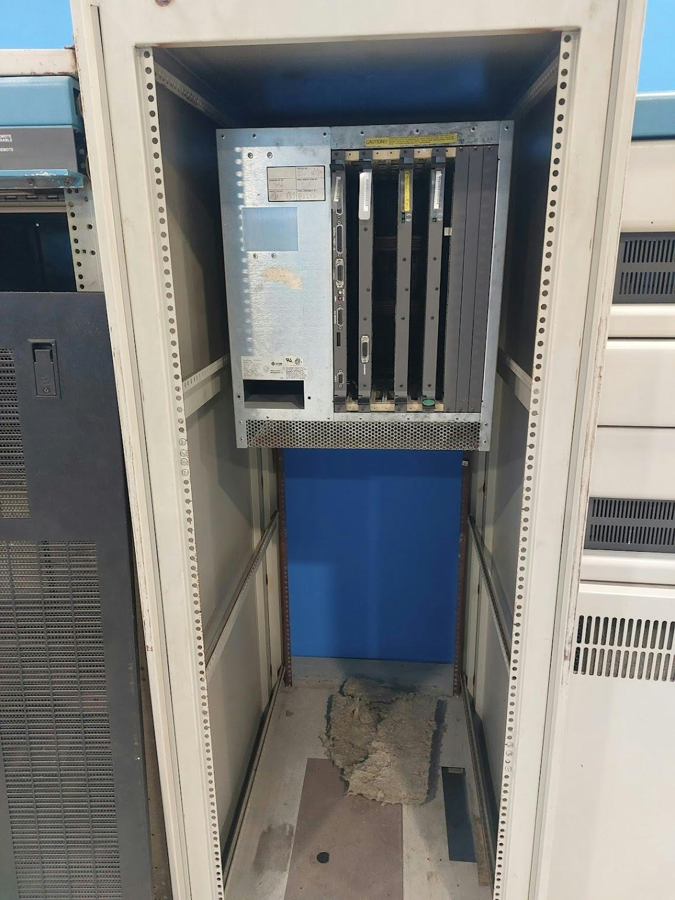

# Sun 3/280S-8

Η σειρά Sun-3 από την Sun Microsystems αποτελείται από υπολογιστές λειτουργικού συστήματος UNIX οι οποίοι εμφανίστηκαν στις 9 Σεπτεμβρίου 1985. Χρησιμοποιούσαν τον μικροεπεξεργαστή Motorola 68020 και τον δίαυλο VMEbus, σε συνδυασμό με τον συνεπεξεργαστή κινητής υποδιαστολής Motorola 68881 και μια κλειστή μονάδα διαχείρισης μνήμης (MMU) της Sun.

Τα συστήματα Sun-3 υποστήριζαν το λειτουργικό σύστημα SunOS εκδόσεις 3.0 έως 4.1.1_U1, όπως και NetBSD και Linux.

Το μοντέλο 3/280 της συλλογής μας (με αρχιτεκτονική Sirius) βασιζόταν στην πλατφόρμα CPU Sun 3200, με συχνότητα CPU 25 MHz, FPU 20 MHz, και μέγιστη διαρρύθμιση μνήμης RAM 32MB.

Το μοντέλο ήταν κατάλληλο για τοποθέτηση σε ικρίωμα και προσέφερε 12 θέσεις VMEbus.

Στο ίδιο ικρίωμα εκτίθεται σκληρός δίσκος Hitachi DK815-10 9 ιντσών, με περιστροφή στα 3600 RPM και χωρητικότητα 892 MB.

