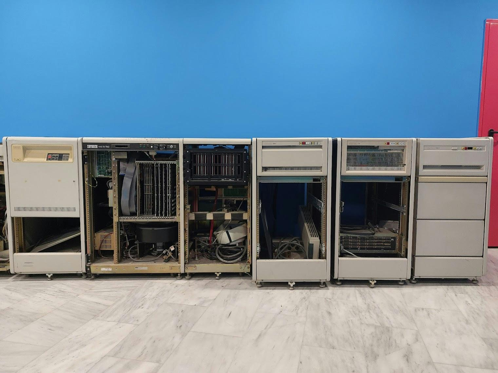

# VAX-11/750

Το VAX-11/750 παρουσιάστηκε το 1980 ως ένα πιο συμπαγές, λιγότερο ταχύ, αλλά φθηνότερο διάδοχο μοντέλο του αρχικού VAX-11/780 της Digital Equipment Corporation (DEC) όπως η Αριάδνη της συλλογής μας.

Το VAX-11/750 είχε σχεδιαστεί γύρω από την κεντρική μονάδα επεξεργασίας (CPU) KA750, οι κύριες λειτουργικές μονάδες της οποίας φαίνονται στο παρακάτω διάγραμμα συστήματος του VAX-11/750.

Υποστήριζε υπάρχοντες διαύλους εισόδου/εξόδου της DEC όπως UNIBUS και MASSBUS. Ένα από τα πρώτα λειτουργικά συστήματα για το VAX-11/750 ήταν το UNIX BSD 4.1.

