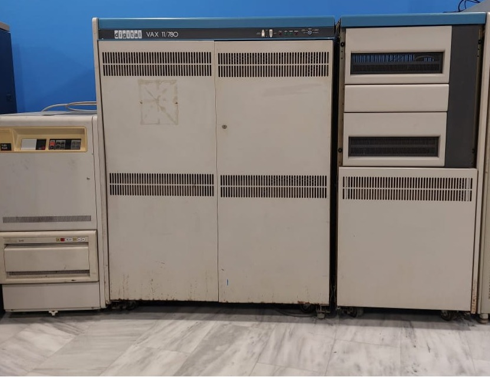

# VAX 11-780 Αριάδνη

Αυτό το VAX 11-780 ονομαζόταν Αριάδνη (Ariadne) και εγκαταστάθηκε το 1983 στο Ινστιτούτο Πληροφορικής του τότε Ερευνητικού Κέντρου Κρήτης και μετέπειτα ΙΤΕ. Η Αριάδνη έτρεχε UNIX BSD 4.2 και ήταν **το πρώτο μηχάνημα στην Ελλάδα που ενσωματώθηκε στο Διαδίκτυο της εποχής μέσω σύνδεσης X.25 και UUCP** με υπολογιστή στην Ολλανδία. Από την Αριάδνη στάλθηκε το πρώτο μήνυμα ηλεκτρονικού ταχυδρομείου μεταξύ Ελλάδας και του έξω κόσμου την Πέμπτη 29 Μαρτίου 1984 και έφτασε στην Αμερική το Σάββατο 31 Μαρτίου (πηγή: Αρχείο Μανόλη Κατεβαίνη)

Η αρχιτεκτονική VAX αναπτύχθηκε από την Digital Equipment Corporation (DEC) στα μέσα της δεκαετίας του 1970. Το σύστημα VAX-11/780 ανακοινώθηκε στα τέλη του 1977 και ήταν το πρώτο από μια σειρά συστημάτων που υλοποίησαν την αρχιτεκτονική VAX, το όνομα της οποίας προήλθε από την έκφραση “Virtual Address eXtension“. Σχεδιαστηκε να αντικαταστήσει και επεκτείνει την προγενέστερη σειρά υπολογιστών PDP-11 της DEC. Χαρακτηριστικά της αρχιτεκτονικής VAX είναι το πολύπλοκο σύνολο εντολών (complex instruction set) των 32 bits, η διαχείριση εικονικών διευθύνσεων με σελιδοποιημένη ζήτηση, και η ύπαρξη εντολών στην αρχιτεκτονική συνόλου εντολών για πολύπλοκες λειτουργίες όπως διαχείριση ουρών και αποτίμηση πολυωνύμων.

