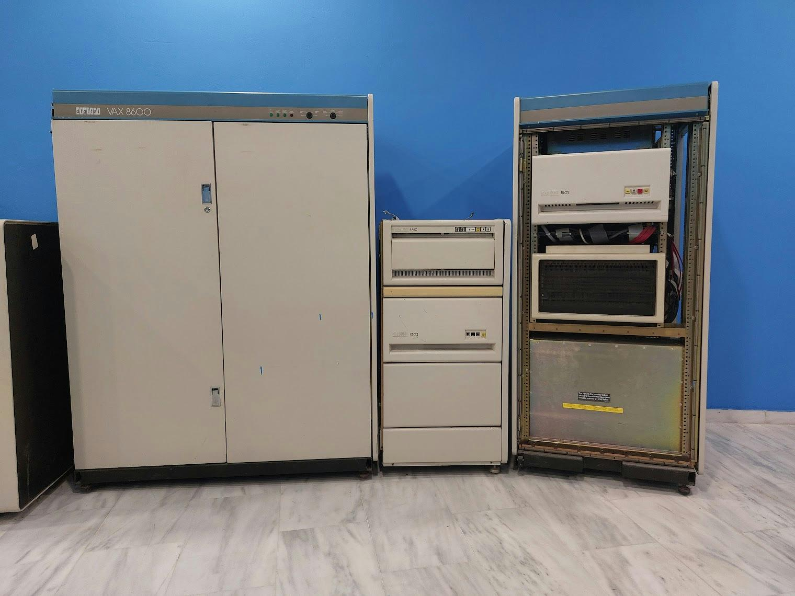

# VAX 8600 - TALOS

Το μοντέλο VAX 8600 παρουσιάστηκε τον Οκτώβριο του 1984 ως διάδοχο του VAX-11/785, με **τετραπλάσια (4x) περίπου ταχύτητα από ένα VAX-11/780 όπως η Αριάδνη της συλλογής μας**. Το VAX 8600 υλοποίησε την αρχιτεκτονική συνόλου εντολών (ISA) της οικογένειας VAX όπως και τα υπόλοιπα μέλη της οικογένειας.

Η κεντρική μονάδα επεξεργασίας (CPU) του είχε κύκλο μηχανής 80 ns (12.5 MHz) και υλοποιήθηκε με συστοιχίες μακροκυψελίδων (macrocell arrays ή MCAs) λογικών πυλών με σύζευξη εκπομπού (ECL). Η CPU αποτελείται από 4 κύριες λογικές ενότητες: E, F, I και M. Η ενότητα E εκτελεί όλες τις εντολές, συμπεριλαμβανομένων των εντολών κινητής υποδιαστολής (floating-point) μέσω μικροκώδικα. Περιέχει μια αριθμητική και λογική μονάδα (ALU) και έναν κυλινδρικό μετατοπιστή (barrel shifter). Η ενότητα F, ή επιταχυντής κυλιόμενης υποδιαστολής (FPA), είναι προαιρετική, για την υποβοήθηση εντολών κινητής υποδιαστολής και πολλαπλασιασμού και διαίρεσης ακεραίων. Η ενότητα I προσλαμβάνει και αποκωδικοποιεί τις εντολές. Η ενότητα M Box ελέγχει την μνήμη και την είσοδο/έξοδο, μεταφράζει εικονικές διευθύνσεις σε φυσικές και περιέχει μια κρυφή μνήμη δεδομένων των 16KB.

