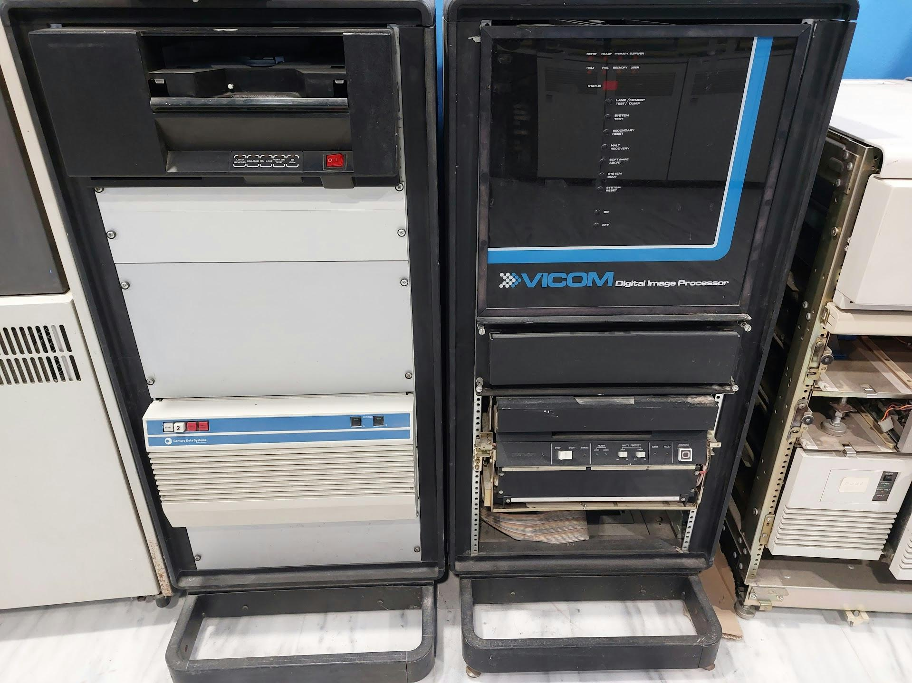

# Vicom Digital Image Processor

Ιστορικό στο Τμήμα: Αποτέλεσε την πρώτη εξειδικευμένη υπολογιστική υποδομή του Εργαστηρίου Επεξεργασίας και Ανάλυσης Εικόνων το οποίο ίδρυσε ο αείμνηστος Στέλιος Ορφανουδάκης και το οποίο μετεξελίχθηκε αργότερα στα τωρινά Εργαστήρια Υπολογιστικής Όρασης και Ρομποτικής (CVRL)  και Υπολογιστικής Βιοϊατρικής (CBML)  του Ινστιτούτου Πληροφορικής του ΙΤΕ. Η φυσική του θέση ήταν το εν λόγω Εργαστήριο στο υπόγειο της πτέρυγας Γ. Χρησιμοποιήθηκε από τα πρώτα μέλη και τους πρώτους υποτρόφους του Εργαστηρίου (Δρ. Ελένη Κωσταρίδου, Tsutomu Shibata, Μιχάλης Κολουντζάκης, Κύρος Κουτουλάκος, Αδάμ Δαμιανάκης, Ευριπίδης Πετράκης, Σπύρος Στεφάνου, Απόστολος Καρμιράντζος,  Αντώνης Αργυρός) σε πολλές εργασίες του Εργαστηρίου, σχετικά με την υπολογιστική μοντελοποίηση του ανθρώπινου ματιού, θέματα επεξεργασίας και ανάλυσης ιατρικών εικόνων, προβλήματα δορυφορικής τηλεπισκόπησης, κ.α.   

